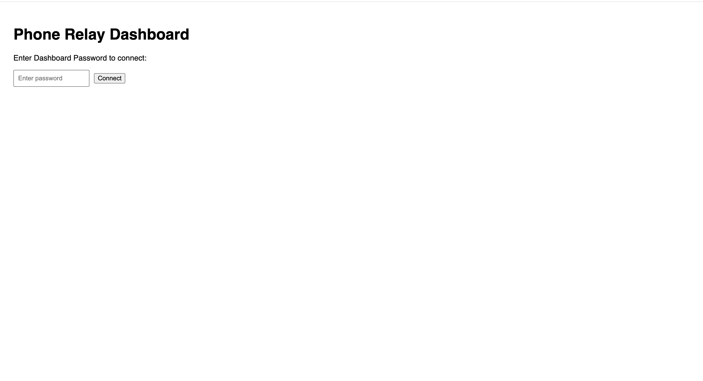
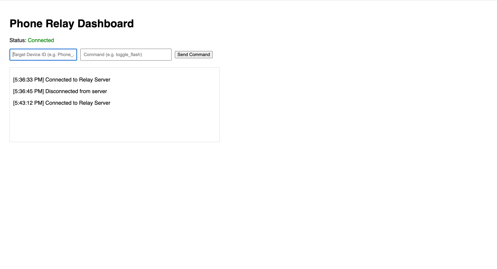
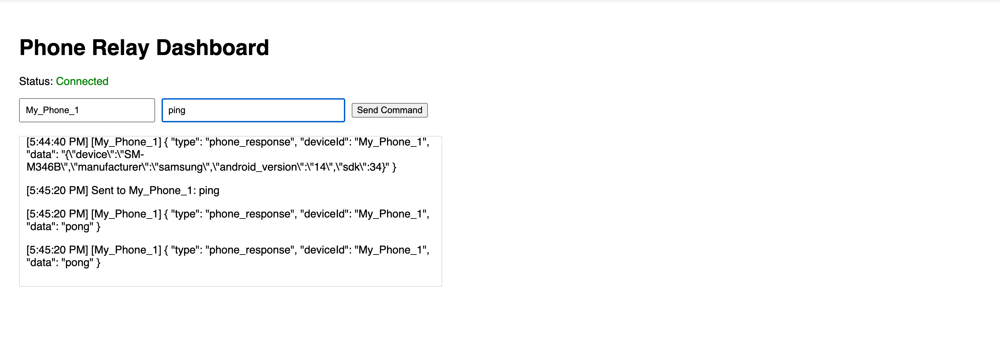
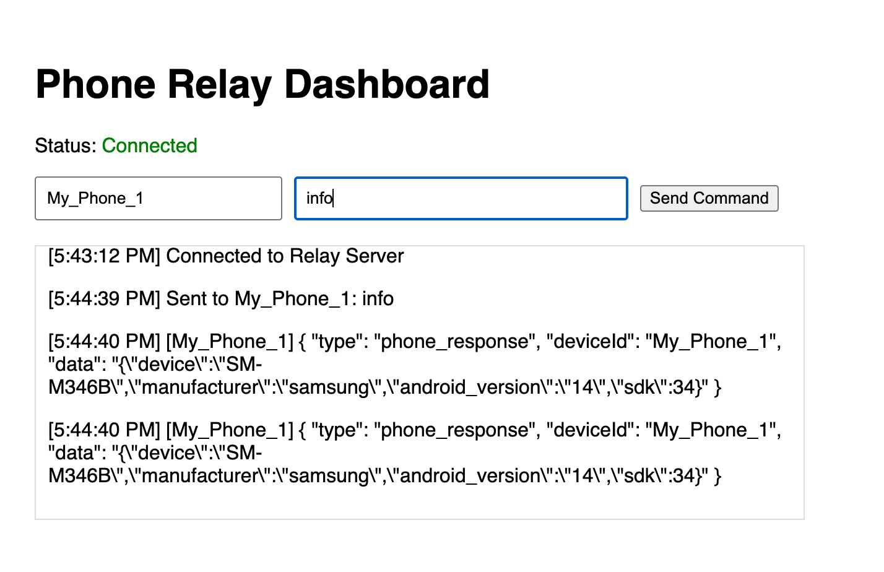
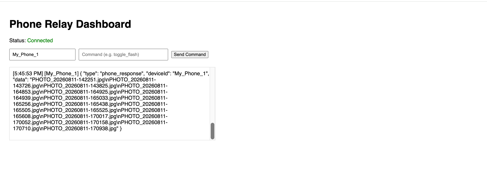
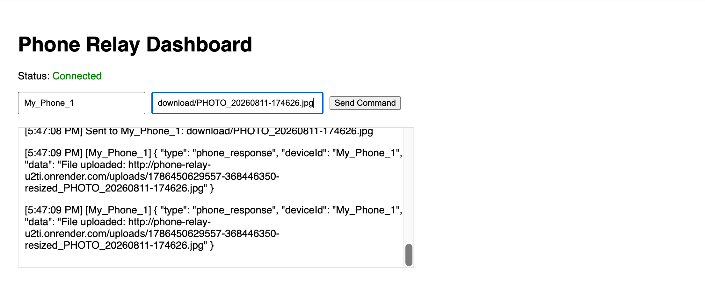
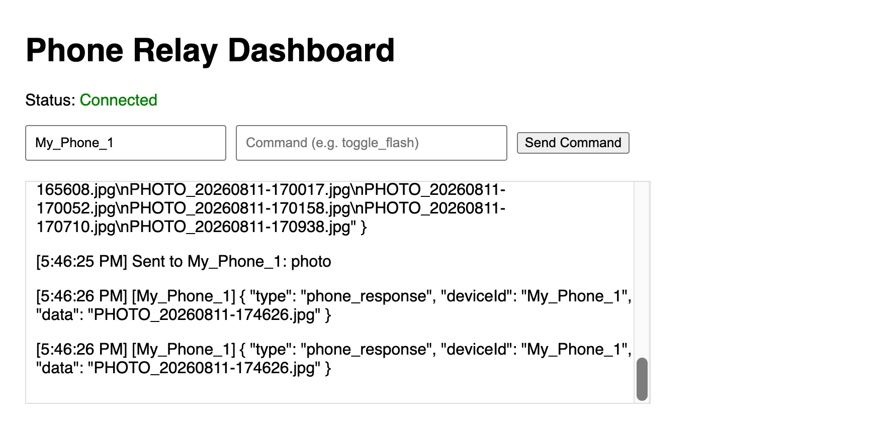
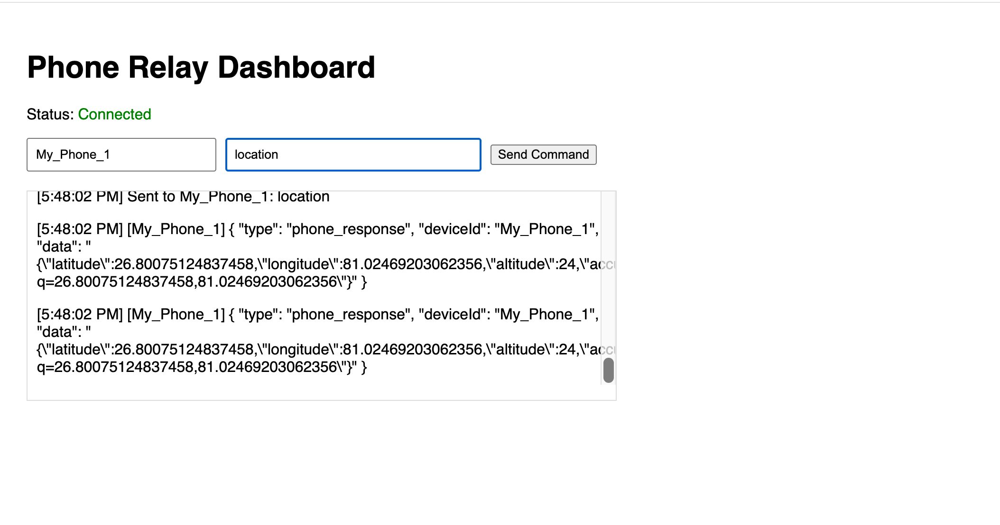

# 📡 Phone Relay – Remote Android Controller

> A full‑stack remote access tool for Android devices. Control the camera, record video, stream location, and download files – all through a secure WebSocket dashboard.

---

## 📸 Screenshots

Here is a quick tour of the dashboard and the most important features you can use.

| Screenshot | Feature Description |
|------------|----------------------|
|  | **Secure Login** – Enter the `DASHBOARD_PASSWORD` you set on Render to access the control panel. |
|  | **Main Dashboard** – After login, you see the connection status, your Device ID, and the command input area. |
|  | **Ping Command** – Quick connectivity test. The phone responds with `pong` if everything is working. |
|  | **Device Info** – Get detailed information about your Android device, including model, manufacturer, Android version, and SDK level. |
|  | **List Files** – View all photos, videos, and audio files stored on your phone. Useful for finding the exact filename to download. |
|  | **Download File** – After sending `download/FILENAME`, the phone uploads the file to Render and returns a public URL. **Click the URL to view or download the file directly in your browser.** |
|  | **Capture Photo** – Take a photo using the rear camera. The file is saved on the phone with a timestamp (e.g., `PHOTO_20260811-170938.jpg`). |
|  | **Get Location** – Fetch real‑time GPS coordinates. The response includes a `maps_url` that opens the exact location in Google Maps. |

> **Note:** Screenshots are for illustration only. Your actual dashboard may vary slightly based on your configuration.

---

## 🚀 Features

- **📸 Camera Control** – Capture photos (rear + front) with automatic resizing.
- **🎥 Video Recording** – Start/stop video recording directly from the web.
- **📍 Location Tracking** – Fetch real‑time GPS coordinates.
- **📂 File Management** – List files and download them (uploaded to Render for easy access).
- **🔐 Secure** – Authentication via dashboard password + phone secret; brute‑force protection.
- **⚡ Real‑time** – Bi‑directional WebSocket communication for instant commands.

---

## 🏗️ Architecture

```
┌─────────────┐      WebSocket      ┌─────────────┐      HTTP       ┌─────────────┐
│   Browser   │ ◄─────────────────► │   Node.js   │ ◄─────────────► │   Android   │
│  Dashboard  │                      │   (Render)  │                  │    Phone    │
└─────────────┘                      └─────────────┘                  └─────────────┘
                                            │                               │
                                            ▼                               ▼
                                     (Uploads folder)               (Camera, GPS, Files)
```

- **Backend** – Node.js + Express + WebSocket (`ws`) hosted on Render.
- **Android** – Kotlin, Ktor (local HTTP server), CameraX, WebSocket bridge.
- **Frontend** – Plain HTML/CSS/JS served from Render.

---

## 📱 Android App Source Code

The Android app source code is available in a separate repository:

🔗 **[https://github.com/mayankrises/android-remote-access-tool](https://github.com/mayankrises/android-remote-access-tool)**

You'll need to **download the APK** from that repository (or build it yourself in Android Studio) and install it on your Android device.

---

## 🛠️ Tech Stack

| Component    | Technologies                                                                 |
|--------------|-------------------------------------------------------------------------------|
| **Backend**  | Node.js, Express, WebSocket (`ws`), Multer, Render.com                       |
| **Android**  | Kotlin, Ktor, CameraX, OkHttp, Coroutines, Lifecycle Services               |
| **Frontend** | Vanilla HTML/CSS/JS, WebSocket API                                          |

---

## 🔧 Setup & Deployment

### Prerequisites
- Node.js (v18+) – for backend
- Android Studio – for APK build (optional, if you want to build from source)
- Render.com account (or any Node.js hosting)

### 1. Backend (Render)

1. Clone this repository:
   ```bash
   git clone https://github.com/yourusername/phone-relay.git
   cd phone-relay
   ```

2. Install dependencies:
   ```bash
   npm install
   ```

3. Set environment variables on Render:

   | Variable              | Description                                                                 |
   |-----------------------|-----------------------------------------------------------------------------|
   | `DASHBOARD_PASSWORD`  | **Required.** A strong password for logging into the web dashboard.        |
   | `PHONE_SECRET`        | **Required.** A long random token (e.g., `crypto.randomBytes(32).toString('hex')`). **This must match the `TOKEN` constant in the Android app's `WebSocketBridgeService.kt`.** |

   > ⚠️ **Important:** The `PHONE_SECRET` in your Render environment **must be identical** to the `TOKEN` value hardcoded in the Android app (`WebSocketBridgeService.kt`). If they don't match, the phone will not be able to connect to the server.

4. Deploy to Render:
   - Connect your GitHub repo to Render (Web Service).
   - Set the build command: `npm install`.
   - Set the start command: `node server.js`.
   - Add the environment variables above.

### 2. Android App

1. Download the APK from the [Android app repository](https://github.com/mayankrises/android-remote-access-tool) or build it yourself in Android Studio.
2. **Important:** Before building/using the APK, make sure the `TOKEN` constant in `WebSocketBridgeService.kt` matches the `PHONE_SECRET` you set on Render:
   ```kotlin
   private val TOKEN = "mySecret123" // Must match PHONE_SECRET on Render
   ```
3. Install the APK on your Android device.

---

## 📱 Usage

1. **Start the service** on your phone (tap *Start Service* in the app).
2. **Open the dashboard** (your Render URL).
3. **Log in** with the `DASHBOARD_PASSWORD` you set.
4. **Find your Phone ID**:  
   When the Android app starts, it registers with the server using a unique **Device ID** (default is `My_Phone_1` in the code).  
   To find the exact Device ID that your phone is using:
   - Go to your **Render Dashboard** → your Web Service → **Logs** tab.
   - Look for a log line that says:  
     `📱 Phone (YOUR_DEVICE_ID) connected!`
   - Copy that Device ID (e.g., `My_Phone_1`).
5. **Paste the Device ID** into the **"Device ID"** field on the dashboard.
6. **Start sending commands** (see the reference below).

---

## 📋 Command Reference & Expected Responses

| Command                | Action & Example Response                                                                                                  |
|------------------------|----------------------------------------------------------------------------------------------------------------------------|
| **`info`**             | Returns device details (model, manufacturer, Android version, SDK).<br>**Response:** `[My_Phone_1] {"device":"SM-M346B","manufacturer":"samsung","android_version":"14","sdk":34}` |
| **`photo`**            | Captures a photo using the **rear camera**. The file is saved on the phone with a timestamp name.<br>**Response:** `[My_Phone_1] PHOTO_20260811-170938.jpg` |
| **`photo/front`**      | Captures a photo using the **front camera** (selfie).<br>**Response:** `[My_Phone_1] PHOTO_20260811-171045.jpg` |
| **`video/start`**      | Starts video recording (saves as `.mp4`).<br>**Response:** `[My_Phone_1] Video started` |
| **`video/stop`**       | Stops video recording.<br>**Response:** `[My_Phone_1] VIDEO_20260811-171200.mp4` |
| **`location`**         | Fetches the current GPS location.<br>**Response:** `[My_Phone_1] {"latitude":28.6139,"longitude":77.2090,"maps_url":"https://maps.google.com/?q=28.6139,77.2090",...}` |
| **`files`**            | Lists all files stored on the phone (photos, videos, audio).<br>**Response:** `[My_Phone_1] PHOTO_20260811-170938.jpg\nPHOTO_20260811-171045.jpg\nVIDEO_20260811-171200.mp4` |
| **`download/FILENAME`**| Downloads any file from the phone.<br>**👉 Special Flow:** <br>1. The phone resizes the image (if it's a photo) and uploads it to Render via an HTTP `POST /upload`.<br>2. Render saves the file in the `uploads/` folder and returns a public URL.<br>3. The dashboard receives the URL and displays it as a clickable link.<br>**Response:** `[My_Phone_1] File uploaded: https://phone-relay-u2ti.onrender.com/uploads/1786448427764-resized_PHOTO_20260811-170938.jpg` |

---

### 🔗 How to View Downloaded Files & Location

1. **When you receive a `File uploaded: https://...` link in the dashboard**, simply **click the link**.
2. Your browser will open the Render URL and display the image (or prompt you to download the video/audio file).
3. **All uploaded files are stored on Render's filesystem** in the `uploads/` folder. You can navigate to `https://your-render-url/uploads/` to see the list (if directory listing is enabled) or directly access the specific filename.
4. **For location responses**, the JSON includes a `maps_url` field. Copy that URL into your browser to open the exact location in Google Maps.
   - Example: `https://maps.google.com/?q=28.6139,77.2090`

---

## 🔒 Security

- **No hardcoded secrets** – all credentials are injected via environment variables (except the phone secret, which must be aligned between the app and the server).
- **Brute‑force protection** – IPs are temporarily banned after 5 failed auth attempts.
- **CSP headers** – mitigate XSS attacks.
- **WebSocket auth** – password is never sent in the URL (sent as a JSON message).
- **File uploads** – restricted to 20MB; files are stored in an isolated folder.
- **Dashboard password** – you must set a strong `DASHBOARD_PASSWORD` to prevent unauthorized access to your phones.

---

## 🤝 Contributing

Pull requests are welcome! Please open an issue first to discuss major changes.

---

## 📄 License

MIT – feel free to use and modify for your own projects.

---

## 🙏 Acknowledgements

- [Ktor](https://ktor.io/) – for the embedded HTTP server on Android.
- [CameraX](https://developer.android.com/training/camerax) – for camera operations.
- [Render](https://render.com) – for hosting the Node.js server.